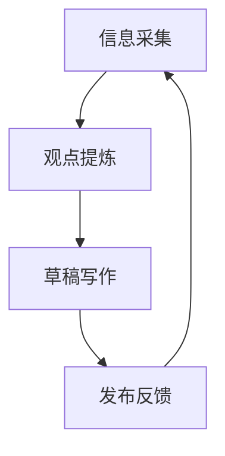

这是一个用于预览风格的示例页面。目标不是讲完整观点，而是验证三件事：

1. 中文长段落是否耐读  
2. 数学公式是否清晰  
3. Mermaid 结构图是否可以自然融入文字叙事  

## 1) 中文正文排版

在 AI 时代，个人生产力并不只来自“工具熟练度”，还来自你能否把零散输入组织成稳定输出。  
一个可持续的写作系统，通常包含三个环节：采集、重组、发布。

> 好写作不是“想清楚了再写”，而是“通过写，逼自己想清楚”。

## 2) 公式展示

当我们粗略建模“有效产出”时，可以先写成：

$$
P_{effective} = C \times F \times R
$$

其中：

- \( C \)：清晰度（Clarity）
- \( F \)：专注度（Focus）
- \( R \)：复利率（Rate of Iteration）

再引入时间维度后，长期质量可以写成：

$$
Q(t) = Q_0 + \int_0^t \alpha \cdot P_{effective}(\tau) \, d\tau
$$

这个模型很粗糙，但足够作为文章中的“讨论锚点”。

## 3) Mermaid 结构图展示



当图示规模较小、语义明确时，它比配图更轻，也更适合技术与方法论文章。

## 4) 代码块展示

```ts
type Note = {
  idea: string;
  evidence: string[];
  nextAction: string;
};

export function toDraft(note: Note): string {
  return `观点: ${note.idea}\n证据: ${note.evidence.join(' | ')}\n下一步: ${note.nextAction}`;
}
```

以上就是风格展示页。你确认视觉方向后，我再继续做完整站点框架与内容模板化。  
